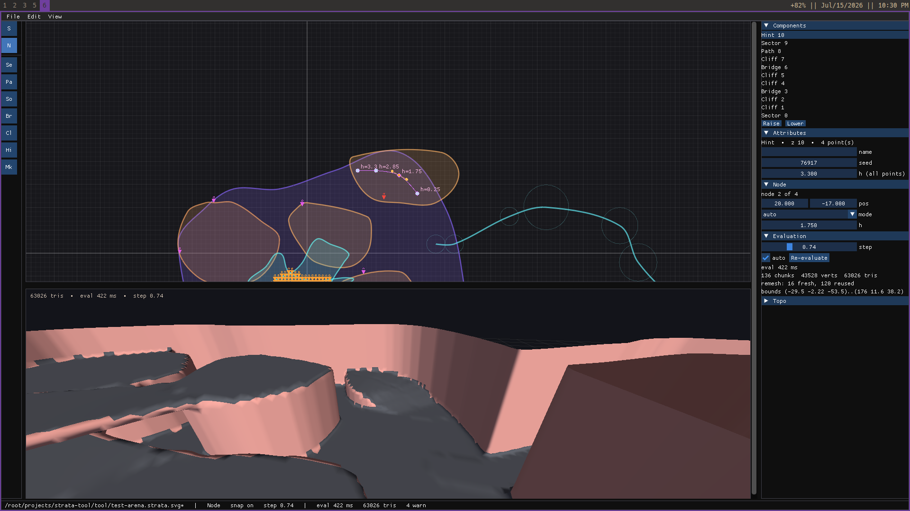
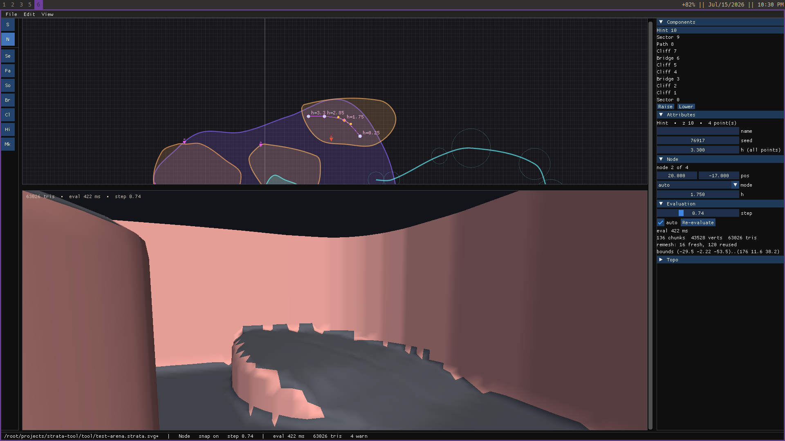
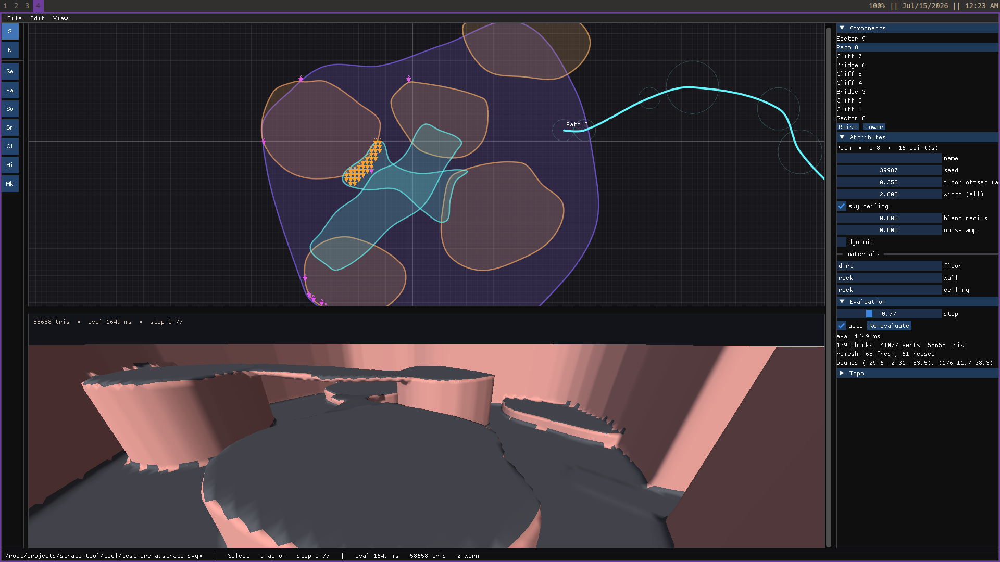

# strata-tool

At its core a **vendorable svg → 3D compiler**: the level *is* a top-down 2D
vector document — an **extended SVG** (`strata:` attribute namespace) of
splines and closed shapes carrying height fields, materials, and gameplay
tags — and all 3D (terrain, walls, meshes, collision) is derived by a
deterministic, threaded evaluator: fields → world SDF → narrow-band
dual-contoured tri-soup. The editor is a frontend bolted onto that compiler:
a real scrolling/zooming 2D vector editor (all editing) piloting a live 3D
pure preview, Hammer-style. See `DESIGN.md`.

|  |  |
|:--:|:--:|
| *Fall-line Hint: node heights fold the floor, cliff → ramp* | *Swept-void Path; all walls/bridges compiler-derived* |

## Using strata as a game's level pipeline

Vendor `src/engine` (plain Odin, `core:` imports only) and wire the compile
into your load path — levels ship as the `.strata.svg` files themselves, and
nothing derived is ever written to the player's disk:

    doc, ok := engine.document_load_svg(path)     // keep doc alive: the world
    world   := engine.eval_world_build(&doc, step) // holds a ^Document
    chunks  := engine.mesh_extract(&world)         // threaded; tri-soup + mats
    // markers/entities: doc.components (.Marker kind), heights via
    // engine.surface_height(&world, pos); level metadata: doc.meta (opaque
    // lines from <strata:meta>); walkability oracle: engine.topo_data_build.
    // Cleanup: mesh_chunk_destroy each chunk, eval_world_destroy,
    // document_destroy — in that order.

Determinism is contract: same document + step ⇒ bit-identical mesh
(`engine.mesh_checksum`), regardless of thread count (`STRATA_THREADS`
overrides the default of all logical cores).

Diagnostics (parse warnings, eval skips, I/O failures) go through
`engine.diag_set_sink(sink, user)` — route them into your own logging/UI;
the default sink prints to stderr. Emits happen only from serial phases
(load/save/eval build), never from mesh workers, so sinks need no locking.

Built with Odin; one binary holds the headless CLI (eval / dump / topo) and
the M3 editor: SDL3_GPU 2D vector canvas + live 3D preview, Dear ImGui chrome.
`vendor/` (static SDL3, prebuilt imgui lib, glslang, fonts) is copied from the
sibling `dymeta-tool` checkout.

## Layout

    src/engine/   THE COMPILER (vendorable, core-only). document schema
                  (document.odin), extended-SVG reader/writer (svg.odin /
                  svg_write.odin), 2D geometry (geom.odin), harmonic
                  height-field solver (field.odin), world SDF evaluator —
                  smooth CSG, noise, cliff fins (sdf.odin), threaded
                  narrow-band dual contouring + checksum (mesh.odin), topo
                  oracle (topo.odin)
    src/tool/     headless CLI (main.odin), OBJ + sidecar dump for external
                  viewers (export_obj.odin) + M3 editor: shell/frame loop
                  (editor.odin), 2D canvas render + edit (canvas2d.odin,
                  canvas_edit.odin), 3D preview (view3d.odin, camera3d.odin),
                  sidebar (sidebar.odin), GPU helpers (gpu.odin), earcut
    shaders/      GLSL -> SPIR-V, #load'ed into the binary
    content/      sample documents + golden outputs (§5)
    tests/        golden.sh — build, evaluate every sample, diff vs goldens
    tool/         built binary (gitignored)

## Build & run

    ./build.sh                                    -> tool/strata
    tool/strata content/samples/canyon.strata.svg        # open the editor
    tool/strata eval content/samples/canyon.strata.svg   # stats + checksum
    tool/strata dump content/samples/canyon.strata.svg   # -> canyon.obj + canyon.txt beside the doc
    tool/strata topo content/samples/canyon.strata.svg   # walkability oracle
    tool/strata resave <doc> <out>                       # writer round-trip
    tests/golden.sh                                      # regression suite (--update)

Editor: `1`/`2` select/node mode, `3`–`9` draw Sector/Path/Solid/Bridge/Hint/
Marker/Cliff (click points, Enter/first-point closes, Ctrl-click = corner node), wheel
zoom, MMB/Space pan, `F` fit, `X` snap, Tab maximize pane, Ctrl+S/Z/Y/D,
F5 re-eval. The 3D pane: RMB orbit, MMB pan, wheel dolly — pure preview.
